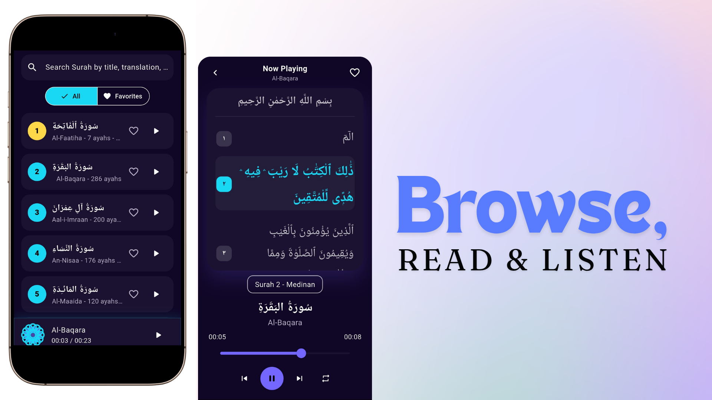
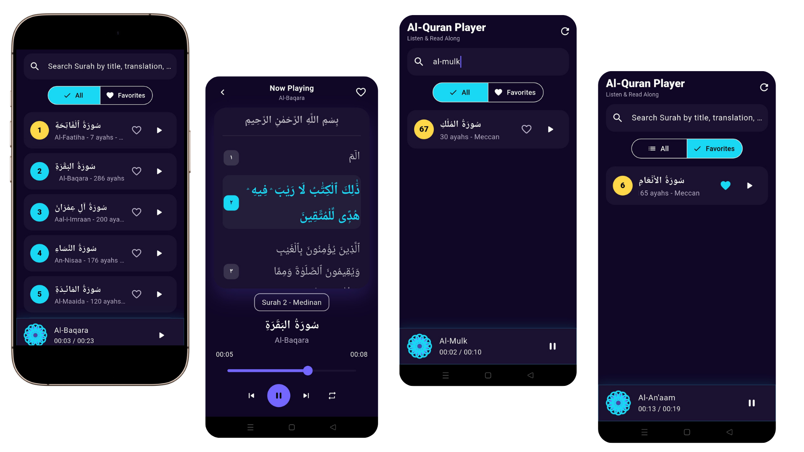

# Quran Player
<p align="center">
  
</p>

Quran Player is a focused Flutter audio application designed specifically for Quran memorization (Tahfidz) and repetition (Muraja'ah). It uses the public [Al-Quran Cloud API](https://alquran.cloud) to load Quran Surah metadata, fetch Arabic ayah text, and stream Mishary Rashid Alafasy recitation audio as playable tracks.

## Features
- Search: Find Surahs by Arabic name, English name, translation, or number.
- Ayah Playback: Stream and manage audio at the verse level, making it ideal for Quran memorization (Tahfidz) and review (Muraja'ah)..
- Verse Looping: Repeat a specific ayah multiple times to help memorize.
- Text Sync: Auto-highlights and scrolls text in real-time with the audio.
- Full Controls: Previous, play, pause, next, and loop actions at the ayah level.
- Slider: Seek and view precise position with a draggable slider.
- Favorites Tab: Save favorite Surahs locally using `shared_preferences`.

## State Management

This project uses `flutter_bloc` with a single `PlayerCubit`.

`PlayerCubit` owns:

- Loading Surahs from the API.
- Loading ayah text for the selected Surah.
- Search query and tab state.
- Favorite add/remove behavior.
- Current Surah selection.
- Playback state streams: playing, position, and duration.
- Playback commands: play, pause, resume, seek, previous, next, and loop.

Widgets are intentionally kept thin. They render the current `PlayerState` and call Cubit methods for user actions.

## Project Structure

```text
lib/
  main.dart
  src/
    app.dart
    core/
      theme/
        app_colors.dart
        app_theme.dart
      utils/
        duration_formatter.dart
    data/
      favorites_store.dart
      quran_api_service.dart
    models/
      ayah.dart
      surah.dart
    presentation/
      pages/
        home_page.dart
        player_page.dart
      widgets/
        geometric_art.dart
        mini_player.dart
        surah_list.dart
        surah_tile.dart
    state/
      player_cubit.dart
      player_state.dart
test/
  unit_test.dart
  widget_test.dart
```

## API Usage

Surah metadata:

```text
GET https://api.alquran.cloud/v1/surah
```

Ayah text:

```text
GET https://api.alquran.cloud/v1/surah/{surahNumber}
```

Audio streaming URL pattern:

```text
https://cdn.islamic.network/quran/audio-surah/128/ar.alafasy/{surahNumber}.mp3
```

## Main Libraries

| Package | Purpose |
| --- | --- |
| `flutter_bloc` | Required BLoC/Cubit state management |
| `http` | Fetch Surah metadata and ayah text |
| `just_audio` | Audio streaming and playback control |
| `shared_preferences` | Local favorites persistence |
| `flutter_test` | Unit and widget tests |

## Setup

Prerequisites:

- Flutter SDK installed.
- Android emulator or physical Android device.
- Internet connection for API metadata and audio streaming.

Run:

```bash
# Clone the repository
git clone https://github.com/shadeq2022/quran_player.git

# Navigate into the project folder
cd quran_player

# Get dependencies
flutter pub get

# Run the app
flutter run
```

## Testing

Run all tests:

```bash
flutter test
```

Current test coverage includes:

- Duration formatting edge cases.
- Surah JSON parsing and audio URL generation.
- Estimated current ayah calculation.
- Search filtering in `PlayerState`.
- Favorites tab filtering in `PlayerState`.
- Widget test for toggling a Surah favorite icon.

## Screenshots
<p align="center">
  
  <br> 
  
</p>

## Known Limitations

- **No Offline Caching**: Audio streaming requires an active internet connection as local MP3 caching is not implemented.
- **API Dependency**: App performance and media playback rely entirely on the availability and uptime of the public Al-Quran Cloud API and CDN network.
- **Sequential Buffering**: Transition between verses depends on network speed, which may cause minor buffering gaps on slower connections.
